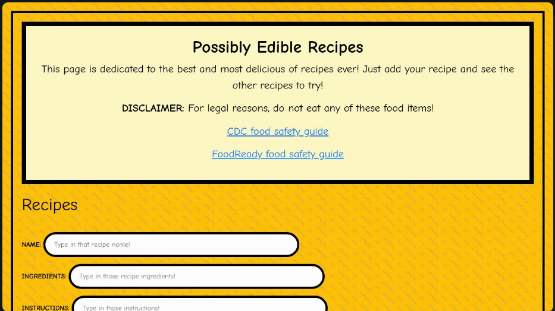
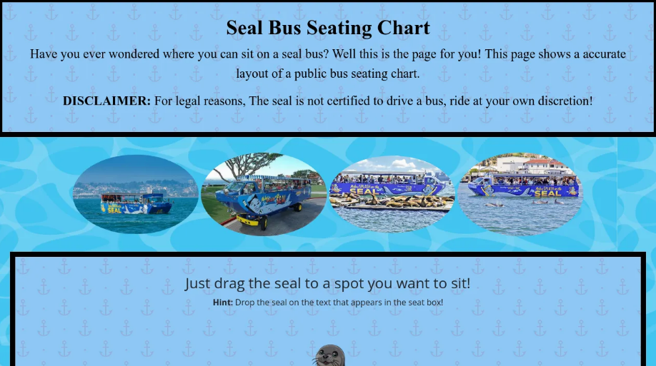

# Charlie the Space Seal's fun silly projects Website

This is a basic website that showcases basic HTML, CSS, JS, jQuery, and Bootstrap functions. <br />
<details> 
This was created as an assignment in a Web Development class during the Spring 2025 semester at The University of North Alabama. Assigned by Barry Cumbie (Link provided below).
<summary>
  Additional Details
</summary>
</details>

## -=- Code Credit -=-
Code: [Kaden Trousdale](https://github.com/Kaden-Trousdale) <br />
Footer: mdboostrap.com <br />
Basic code structure: [Barry Cumbie](https://github.com/barrycumbie) <br />

## -=- Footer Links -=-
Wireframe: https://github.com/Kaden-Trousdale/Charlie-Assignment-Repo/blob/main/images/charlieWireframe.jpg <br />
Source: https://github.com/Kaden-Trousdale/Charlie-Assignment-Repo/blob/main/pages/charlieSource.html <br />
nu Validator: https://validator.nu/?doc=https%3A%2F%2Fkaden-trousdale.github.io%2FCharlie-Assignment-Repo%2F <br />
WAVE: https://wave.webaim.org/report#/https://kaden-trousdale.github.io/Charlie-Assignment-Repo/ <br />
Github: https://github.com/Kaden-Trousdale/Charlie-Assignment-Repo <br />
Codepen: [https://codepen.io/your-work](https://codepen.io/Kaden-Trousdale) <br />

## Code Link

You can find the full project code here:  
[GitHub Repository](https://github.com/Kaden-Trousdale/Charlie-Assignment-Repo/tree/main)

## Features

- Cards: Showcases card layout, design, and functions.
- Header/Footer: Showcases basic Header and Footer design. 
- Hamburger Menu: Showcases a dropdown hamburger menu in the Header.
- Mouse Hover Function: Showcases mouseover function event.
- Multiple-page Site: Showcases a site with a multiple-page layout.

## Code Highlights

### Cards Code

```html
<div class="col-sm-4">
    <div class="card">
      <div class="card-body">
        <h4 class="card-title">Possibly Edible Recipes</h4>
        
        <p class="card-text"> Possibly Edible Recipes, created under the Able Project, is a blog site. The main aim of the site is to share recipes that may or may not be edible to the general public. The page and its source code can be found below. </p>
        <a href="pages/ablePageApp.html" class="card-link" target="_blank">Possibly Edible Recipes app</a>
        <a href="pages/ablePageSource.html" class="card-link" target="_blank">Possibly Edible Recipes source code</a>
      </div>
    </div>
  </div>
<!-- Baker Card -->
  <div class="col-sm-4">
    <div class="card">
      <div class="card-body">
        <h4 class="card-title">Seal Bus Seating Chart</h4>
        
        <p class="card-text"> Seal Bus Seating Chart, created under the Baker Project, is a site dedicated to the Seal Bus Tour Company. Here you can reserve your seat using an amazing seal! You can also read about the driver, a seal named Sock who accepts fish as payment! The page and its source code can be found below.</p>
        <a href="pages/bakerPageApp.html" class="card-link" target="_blank">Seal Bus Seating Chart app</a>
        <a href="pages/bakerPageSource.html" class="card-link" target="_blank">Seal Bus Seating Chart source code</a>
        
      </div>
    </div>
  </div>
</div>
</div>
```

  

